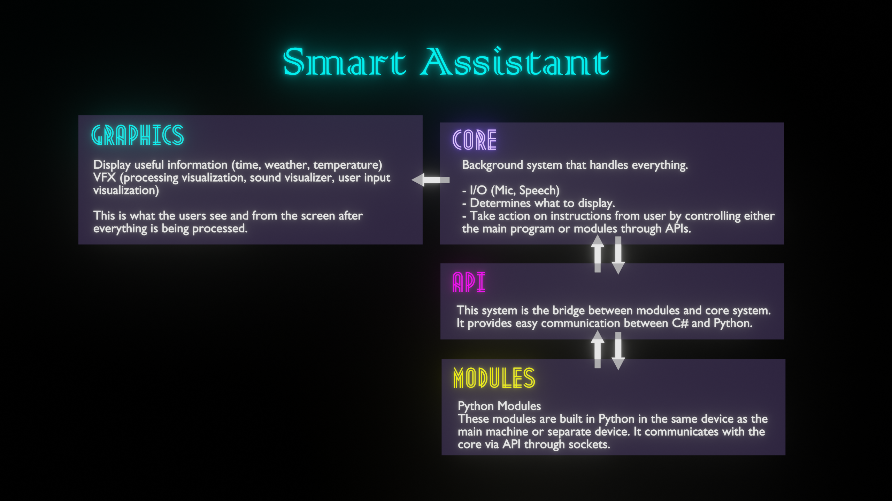

<!--  -->

#  Smart Assistant

I have created a [YouTube playlist](https://www.youtube.com/watch?v=ncER2nHWTko&list=PLlnBGPe6GFdMxJwR8YXo_GfE1LtnTZfbk) for this project.

This is a basic overview of the Smart Assistant project:

# Smart Assistant

This project aims to create a fully functional smart assistant that is able to control your house and automate them. 
You can look at our plan at [Milanote](https://app.milanote.com/1KPrwu1FVZ7S2G?p=UGrY3QR3ztP).
To get more details on what Smart Assistant is, head to our [documentation](https://docs.google.com/document/d/1VVpCAUW7GcWCcOrWAtEkXxx1AH59J9e59fqEaYfNGSw/edit?usp=sharing) and also our [Miro](https://miro.com/welcomeonboard/N49aNY6BBYnq58GVk5gkTm2Vzg7k4OVYFuFsTSrVD7O4zjHOaLg5PMvg2Ut1rYHG) board for a visualization of the whole workflow and process.

## Usage

This project uses Unity (specifically the Universal Render Pipeline) as the GUI and Python as the API for the modules that users build. This project is tested on Windows 10 and is highly recommended to run in Windows OS although it is portable to Linux or Mac OS as Unity and Python are both multi-platform portable.

## Common Questions

**Microsoft Visual C++ is required**
- Install Visual Studio Installer via this [link](https://aka.ms/vs/16/release/vs_buildtools.exe) and install C++ build tools.

## Build Settings

- **Python**: Python 3.7.6
- **Unity URP**: 2021.1.(0f1) *you can use any 2021.1 version but keep in mind that you will be changing the source code and out of sync from this repository*
- **Tensorflow**: v2.3.1

## Support Us!

Support us on [Patreon](https://www.patreon.com/smartassistant)!

## License

Smart Assistant as a whole is licensed under the GNU Public License, Version 3. Individual files may have a different, but compatible license.

See [license file](./LICENSE) for details.
